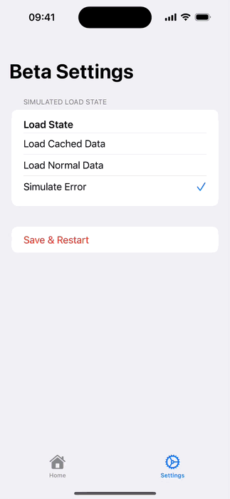

# Formidabble

Formidabble is a Swift-based app for rendering and managing complex, hierarchical forms with ease. Designed with clarity, performance, and offline support in mind, it offers a delightful experience for collecting structured data across platforms. Build forms that are not just fillable — but formidabble.




## ✨ Features

- **Hierarchical Form Display**
  - Pages, Sections, and Questions with proper visual hierarchy
  - Expandable/collapsible sections for better navigation
  - Support for both text and image questions

- **Robust Error Handling**
  - Graceful handling of network failures
  - Clear error messages with actionable suggestions
  - Automatic fallback to cached data

- **Offline Support**
  - Automatic caching of form data
  - Visual indicator when using cached content
  - Seamless transition between online and offline modes

- **Cross-Platform**
  - Native iOS and macOS support
  - Shared business logic across platforms
  - Platform-specific UI optimizations

## 🧠 Architecture Philosophy

Formidabble follows a **modular, scalable architecture** inspired by [merowing’s posts](https://www.merowing.info/), with a clear separation of concerns from day one:

- **Workspace-driven structure**  
  Manual creation of `.xcworkspace` avoids entangling logic and UI with IDE-generated clutter.

- **Packages first, App last**  
  Code lives in Swift Packages inside the `Packages/` directory — the app target in `Apps/` is just a thin entry point, importing features from packages.

- **Clean boundaries**  
  Each package (e.g. `AppFeature`, `SharedModels`) has a single responsibility, tests, and no unnecessary dependencies.

- **Extreme Packaging**  
  Everything is wrapped tightly — even utility logic lives in separate targets when needed. This lets you swap, test, or isolate functionality effortlessly.

### 🧱 Example Layering

```
Apps/
├── iOSApp/
│	└── FormidabbleMobileApp.swift → imports AppFeature
└── macOSApp/
    └── FormidabbleDesktopApp.swift → imports AppFeature   

Packages/
├── AppFeature/
│   └── AppView.swift → imports HomeFeature
├── HomeFeature/
│   └── HomeView.swift → uses SharedModels
├── SharedModels/
│   └── QItem.swift, Enums.swift
```

> ✅ This approach makes the architecture future-proof, testable, and platform-agnostic from the start.

### 📦 Project Setup Steps

#### 1. Clone the Base Structure

Begin by downloading the foundational structure from my [ExtremePackaging](https://github.com/mihaelamj/ExtremePackaging/tree/stage/01-init-packages) repository.

This provides a ready-to-go Swift Package layout with linting support:

```
.gitignore
.swiftformat
.swiftlint.yml
LICENSE
README.md
Packages/
Apps/
```

#### 2. Add Workspace

Create a new Xcode workspace manually in the root of the project (I call it `Main.xcworkspace`).  
Then add the `Packages` folder to the workspace.  
This integrates your package structure into the workspace.

#### 3. Add App Targets

Under the `Apps` directory, create new SwiftUI app targets using Xcode.  
Add these apps to the workspace. Each app target should only depend on the required feature modules from `Packages`.  
Examples:

- `FormidabbleDesktop`
- `FormidabbleMobile`

---

This setup allows all logic to live inside Swift packages, with the app targets serving as light entry points. You can easily test, scale, and replace modules without impacting the rest of the system.


## 🎯 Challenge Requirements

This project was built in response to the Lumiform iOS Code Challenge, implementing:

- JSON data fetching from a mock API endpoint
- Hierarchical display of Pages, Sections, and Questions
- Proper font size hierarchy for different content types
- Image handling with full-screen view support
- Offline support with graceful fallback
- Error handling with user-friendly messages

## 🛠 Development

### Prerequisites
- Xcode 15.0+
- iOS 16.0+ / macOS 13.0+
- Swift 5.9+

### Building
1. Clone the repository
2. Open `Main.xcworkspace` in Xcode
3. Select your target platform (iOS or macOS)
4. Build and run

### Testing
- Unit tests are included for all major components
- Run tests using Cmd+U in Xcode

## 📝 License

This project is licensed under the MIT License - see the [LICENSE](LICENSE) file for details.
